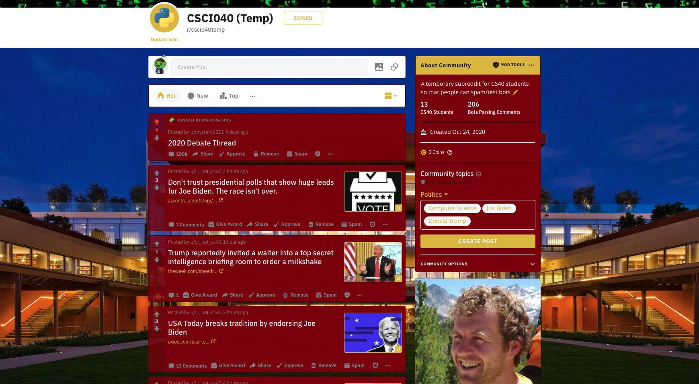
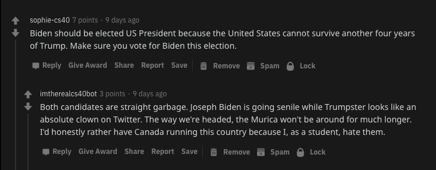

# Political Bot

### A repo for my CS40 reddit bot along with the subreddit I created

#### A note before I go into my bot:

1. I'm somewhat proud of the [subreddit](https://www.reddit.com/r/csci040temp/) that I created in desperate times
2. The subreddit has a shameless plug for Mike Izbicki's website, and I made it look pretty (cause I enjoy front-end development)
3. That's it. Just wanted to boast about the subreddit for maybe 5 extra credit points *wink wink*

#### Things to know about my bot:

* My bot is intended to be used for CS40, and graded by Mike Izbicki
* The bot is *intended* to support Donald Trump, but also has an option of trashing both candidates
* If edited slightly, the bot will upvote or downvote comments or submissions based on the **textblob** library
* The comment_counter.py file was included to test how many valid comments I had in the subreddit/post

#### An example of what the bot does:

As you can see, the bot created a comment that trashed both candidates, which I thought was hilarious and shows that the bot can look human as well!
